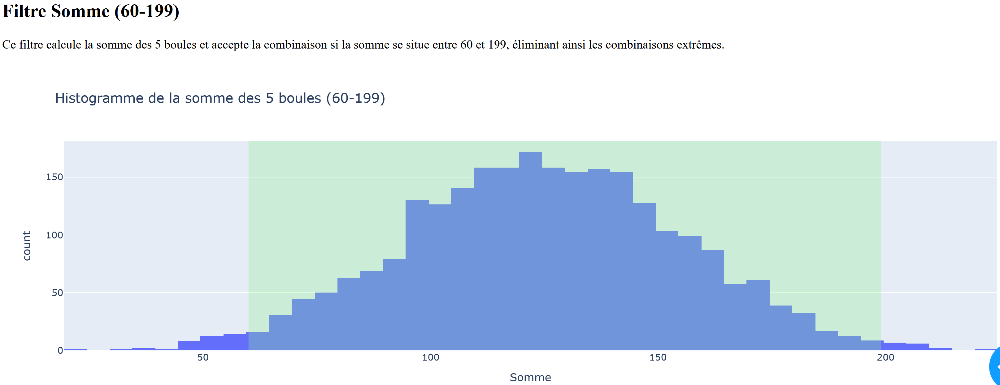

**INTRODUCTION**

  L'origine de ce projet prend racine dans une volonté d'approfondir les analyses statistiques existantes sur les jeux de hasard, plus spécifiquement sur le Loto et l'EuroMillions. En effet, bien que divers sites web proposent déjà des statistiques telles que les numéros les plus ou les moins fréquemment tirés, ces analyses restent généralement superficielles et peu concluantes pour établir une stratégie de jeu pertinente. C'est pourquoi ce projet ambitionne d'aller beaucoup plus loin dans l'étude statistique, en explorant notamment des approches plus poussées pour identifier des combinaisons potentiellement gagnantes.

Une première réflexion a porté sur le choix du jeu : Loto ou EuroMillions ? L'EuroMillions propose certes des jackpots bien plus attractifs, atteignant fréquemment plusieurs dizaines voire centaines de millions d'euros. Toutefois, le nombre très élevé de combinaisons possibles (plus de 139 millions) et la grande popularité du jeu réduisent considérablement les probabilités individuelles de gain élevé, notamment en raison du partage du jackpot entre les nombreux gagnants potentiels. À l'inverse, le Loto, bien que proposant des jackpots généralement inférieurs, offre une probabilité plus favorable en raison d'un nombre de combinaisons possibles beaucoup plus réduit (environ 19 millions).

Pour mieux comparer ces deux jeux, une analyse comparative des gains potentiels obtenus avec les mêmes combinaisons gagnantes a été réalisée (voir tableau comparatif joint). Les résultats montrent clairement que, pour un même nombre de numéros trouvés, le Loto offre généralement des gains plus intéressants pour les combinaisons intermédiaires.

  L'objectif principal de ce projet sera ainsi de déterminer s'il est possible, par une analyse statistique poussée, d'augmenter significativement ses chances de trouver une combinaison gagnante au Loto. Peut-on identifier des régularités, des motifs ou des combinaisons particulièrement avantageuses grâce à une approche méthodique et rigoureuse ? C'est à cette question que tentera de répondre cette étude statistique approfondie.

Pour entreprendre une étude statistique sur le Loto, la première étape consiste à télécharger l'historique complet des tirages, à trier les colonnes et à ne conserver que les données pertinentes. Initialement, de nombreux calculs peuvent être effectués sur Excel. Cependant, on constate rapidement que cet outil manque de performance pour traiter de grands volumes de données. Il est donc judicieux de se tourner vers des solutions plus robustes, comme la programmation avec Python et l'utilisation de bases de données SQL. Cette transition permet d'automatiser les analyses, d'explorer des ensembles de données plus vastes et d'appliquer des méthodes statistiques avancées.

Au cours de nos recherches, nous nous sommes interrogés sur la possibilité d'adopter une stratégie visant à acheter toutes les combinaisons possibles pour garantir un gain. Cette idée fait écho à l'histoire de Stefan Mandel, un mathématicien qui a remporté la loterie à 14 reprises en utilisant une méthode similaire. Stefan Mandel a développé une stratégie basée sur des calculs mathématiques précis pour augmenter ses chances de gagner à la loterie. Sa méthode consistait à acheter des billets couvrant presque toutes les combinaisons possibles, notamment lorsque le jackpot était suffisamment élevé pour assurer un profit, même en tenant compte de l'investissement initial. Il a appliqué cette méthode avec succès dans plusieurs pays, notamment en Australie et aux États-Unis, remportant ainsi de nombreux jackpots.

**Calcul du nombre total de combinaisons et du coût associé :**

- **Nombre de combinaisons possibles :** Au Loto français, une grille consiste à choisir 5 numéros parmi 49, ainsi qu'un numéro Chance parmi 10. Le nombre total de combinaisons possibles est donc de 19 068 840.
- **Coût total pour jouer toutes les combinaisons :** Le prix d'une grille standard étant de 2,20 €, le coût total pour couvrir toutes les combinaisons serait de 19 068 840 × 2,20 € = 41 551 448 €.

**Rentabilité potentielle en fonction du jackpot :**

Pour que cette stratégie soit rentable, le jackpot doit être supérieur au coût total des grilles, soit plus de 41,5 millions d'euros. Il est important de noter qu'il n'est plus possible d'acheter autant de tickets en physique. Cependant, avec la possibilité d'acheter ses tickets de Loto sur internet, rien n'interdit, a priori, l'achat en masse. Ainsi, si le jackpot dépasse un jour ce montant et que vous disposez déjà d'une telle richesse, vous savez ce qu'il vous reste à faire (ou alors vous associer avec des amis fortunés). Ne disposant pas d'une telle richesse, nous allons nous pencher sur des gains inférieurs.

Combien de tickets faut-il acheter pour viser une combinaison de 3 boules et 1 numéro Chance, ou 2 boules et 0 numéro Chance ? Combien pourrait-on gagner en tout ? Est-ce rentable ? Beaucoup de questions auxquelles nous tenterons de répondre. Mais pour cela, il ne faut pas uniquement faire des études statistiques sur l'historique du Loto, mais générer toutes les combinaisons possibles et y appliquer des filtres relatifs à nos études.

**LES FILTRES**

1. **Filtre Somme (filtre_somme)**

- **Objectif :** S'assurer que la somme des 5 numéros choisis se situe dans une plage considérée comme réaliste, évitant ainsi les combinaisons aux extrêmes peu probables.
- **Paramètres :** SOMME_MIN = 60, SOMME_MAX = 199.
- **Logique :** Ce filtre accepte une combinaison si la somme totale des 5 numéros est comprise entre 60 et 199 inclusivement.

  <table>
    <tr>
      <td style="border: 10px solid lightblue; border-radius: 10px; padding: 10px;">
        
      </td>
    </tr>
  </table>

2. **Filtre Dizaines (filtre_dizaines)**

- **Objectif :** Éviter les combinaisons où trop de numéros appartiennent à la même dizaine, ce qui est statistiquement moins courant.
- **Paramètres :** DIZAINES_MAX = 3 (maximum de 3 numéros par tranche de dix).
- **Logique :** Pour chaque tranche de dix (0-9, 10-19, etc.), ce filtre vérifie qu'il n'y a pas plus de 3 numéros présents.

3. **Filtre Suite (filtre_suite)**

- **Objectif :** Limiter les séquences de numéros consécutifs, car les longues suites sont rares dans les tirages.
- **Paramètres :** SUITE_MAX = 3 (maximum de 3 numéros consécutifs).
- **Logique :** Ce filtre compte les séquences où les numéros se suivent. Si une suite de 4 numéros consécutifs ou plus est détectée, la combinaison est rejetée.

4. **Filtre Médiane (filtre_mediane)**

- **Objectif :** Contrôler la médiane des écarts entre les numéros consécutifs pour éviter des dispersions trop faibles ou trop élevées.
- **Paramètres :** MEDIAN_MIN = 2.5, MEDIAN_MAX = 12.5.
- **Logique :** Après avoir trié les numéros, ce filtre calcule les différences entre chaque numéro consécutif et en détermine la médiane. Si cette médiane n'est pas comprise entre 2.5 et 12.5, la combinaison est rejetée.

5. **Filtre Variance (filtre_variance)**

- **Objectif :** Mesurer la dispersion des numéros pour éviter des combinaisons trop regroupées ou trop éparpillées.
- **Paramètres :** VARIANCE_MIN = 20, VARIANCE_MAX = 355.
- **Logique :** Ce filtre calcule la variance des 5 numéros. Une variance trop faible ou trop élevée indique une distribution inhabituelle des numéros, et la combinaison est alors rejetée.

6. **Filtre Écart Consécutif (filtre_ecart_consecutif)**

- **Objectif :** Limiter les répétitions d'écarts identiques entre numéros consécutifs.
- **Paramètres :** ECART_CONSECUTIF = (1, 5, 2) :
  - Écart entre 1 et 5.
  - Maximum de 2 répétitions consécutives.
- **Logique :** Ce filtre rejette les combinaisons où un même écart se répète plus de 2 fois consécutivement entre les numéros triés.

7. **Filtre QuartileShift (filtre_quartileshift)**

- **Objectif :** Valider la position des numéros selon des zones prédéfinies pour assurer une distribution équilibrée.

Pour tester ce filtre, plusieurs méthodes ont été évaluées, mais c'est la méthode Quartile Shift qui a été sélectionnée. Elle s'inspire du filtrage par quartiles tout en intégrant une correction basée sur l'écart entre la médiane et la moyenne. Cela permet d'ajuster les bornes en fonction des asymétries des distributions, offrant ainsi une meilleure représentation des tendances des tirages.

Plusieurs méthodes ont été testé en utilisant le programme testBorne95.py.

- **Logique :** Pour chaque numéro, un score est attribué selon sa zone :
  - 1.0 pour une zone centrale (verte).
  - 0.4 pour une zone intermédiaire (orange).
  - 0.0 pour les autres zones (rouge).

La combinaison est acceptée si le score total est compris entre 2.5 et 5.0.

8. **Filtres Somme3F/Somme3C/Somme3L**

- **Objectif :** Contrôler la somme des groupes de trois numéros au sein d'une combinaison pour s'assurer qu'ils se situent dans des plages considérées comme réalistes. « 3 First », « 3 Center », et « 3 Last ».
- **Paramètres :**
  - **SOMME3F_MIN = 13, SOMME3F_MAX = 101 :** Ces bornes concernent la somme des trois premiers numéros de la combinaison.
  - **SOMME3C_MIN = 29, SOMME3C_MAX = 122 :** Ces bornes s'appliquent à la somme des trois numéros centraux.
  - **SOMME3L_MIN = 49, SOMME3L_MAX = 138 :** Ces limites concernent la somme des trois derniers numéros.
- **Logique :** Pour chaque combinaison, ce filtre calcule les sommes des trois premiers, trois centraux et trois derniers numéros. Si l'une de ces sommes ne se situe pas dans la plage spécifiée, la combinaison est rejetée.

9. **Filtre MPS (Mean Population Similarity) (filtre_mps)**

- **Objectif :** Mesurer la similarité moyenne d'une combinaison avec les tirages historiques pour éviter les répétitions.
- **Paramètres :** MPS_MIN = 0.095, MPS_MAX = 0.107.
- **Logique :** Pour chaque combinaison, ce filtre calcule le nombre moyen de numéros communs avec l'historique des tirages. Si cette moyenne n'est pas comprise entre 0.095 et 0.107, la combinaison est rejetée.

Bon clairement, en regarde l’histogramme, on se rend compte que la méthode de calcul n’est pas la bonne. Alors pourquoi en est-on arrivé là ?

- On a regardé le nombre de similarité (boule en commun) entre un tirage et les tirages précédent. Pour cela, on prend un tirage de l’historique et on le compare avec son tirage précédent « n-1 », et les deux précédents « n-2 »…Etc. On obtient ainsi :

On se rend compte que pour des tirages proche (n-1, n-2) les similarités sont majoritairement de 0, 1, et 2. Mais très peu de tirage avec des similarités de 3 ou plus. Mais que se passe-t-il si on compare avec beaucoup plus de tirage ?

Cette fois-ci la similarité maximal entre 1 tirage et beaucoup d’autre les 500 tirages précédents, voire les 1000 tirages précédent, cette fois-ci on tend plutôt vers une similarité de 3 ou 4.

J’ai voulu alors attribué un score en fonction de la similarité avec l’historique. Pour chaque comparaison, on divise le nombre de numéros communs par 5 (puisque chaque combinaison contient 5 boules) pour obtenir une mesure normalisée. Ensuite, on calcule la moyenne de ces valeurs sur l'ensemble des tirages historiques.

Mais en visualisant l’histogramme, on voit bien que la distribution n’est pas bonne. Il n’y a pas de tendance, On aurait du rester sur la notion de similarité max avec un grand nombre de combinaison de l’historique.

10. **Filtre Comparatif (filtre_comparatif)**

- **Objectif :** Éviter les combinaisons trop similaires aux tirages récents, réduisant ainsi la probabilité de répétition.
- **Paramètres :** SIMILARITE_RECENTE_THRESHOLD = 3 (seuil de similarité fixé à 3 numéros).
- **Logique :** Ce filtre compare chaque nouvelle combinaison aux 10 derniers tirages. Si une combinaison partage au moins 3 numéros avec l'un de ces tirages récents, elle est rejetée.

On a donc un filtre mps qui statu d’un score en fonction de similarité avec tout l’historique, et un filtre comparatif qui compare avec les 10 tirages précédents.

**TEST SUR L’HISTORIQUE**

Lorsqu’on applique tous ces filtres en même temps, que se passe-t-il ? On va d’abord tester tous ces filtres sur l’historique.

Il s’agit du résultat des filtres avec les paramètres que j’ai choisi. Bien entendu chacun peut ajuster ces paramètres en fonction de ses souhaits.

Maintenant la question c’est : en appliquant ces mêmes filtres combien de combinaison possible reste-il ???

**APPLICATION SUR TOUTES LES COMBINAISONS POSSIBLES ?**

On calcul tous les filtres, et on peut choisir d’extraire les combinaisons avec tous les filtres de passés, ou seulement 12 sur 13, 11 sur 13 ou moins. En sélectionnant un filtrage complet (13 filtres sur 13) on extrait 1 465 138 combinaisons. On a donc enlevé seulement 441 746 combinaisons. On n’a enlevé que 23% de combinaisons possibles.

Ça ne va pas nous rendre riche. Sauf si la gain pour une combinaison 5 boules trouvé et 0 numéro chance dépasse les 3,23 millions d’Euros. Peu probable…

Mais alors, si on cherche une combinaison plus petite, si on cherche à avoir seulement 4 boules de bonne ? 3 boules ? 2 boules ?

Ça donnerait quoi ?

**REGROUPEMENT HEURISTIQUE**

On va appliquer une méthode de regroupement heuristique afin de déterminer les combinaisons avec 4 boules sur 5, 3 boules sur 5 et 2 boules sur 5.

**Heuristique 4 sur 5** : Cette méthode parcourt les combinaisons triées et regroupe celles qui partagent au moins 4 numéros identiques, ne conservant que la plus petite combinaison de chaque groupe.​

**Heuristique 3 sur 5** : Similaire à la précédente, cette heuristique regroupe les combinaisons ayant au moins 3 numéros en commun, en ne conservant que la plus petite de chaque groupe.​

**Heuristique 2 sur 5** : Cette méthode regroupe les combinaisons partageant au moins 2 numéros identiques, en ne gardant que la plus petite de chaque groupe.

Là, on voit nos probabilité de gain explosées ! On diminue drastiquement le nombre de combinaisons.

Maintenant, il faut tester et vérifier avec la réalité.

**RESULTATS**

Nous allons ici tester les combinaisons tiré de notre regroupement heuristique 2 sur 5. Et tester sur plusieurs tirage.

Bon…on ne va pas être riche tout de suite. Sauf le 4 janvier 2025 où on a eu de la chance. Ce qui est plutôt étonnant c’est de se retrouvé régulièrement avec des similiarités supérieur à ceux espérés. On s’attendait à trouver des similarités max de 2-0 (2 boules 0 numéro chance), éventuellement 1 étoile chance (qui sont alors générés aléatoirement). Et pourtant on trouve assez souvent des 3-0 voire 3-1 !
